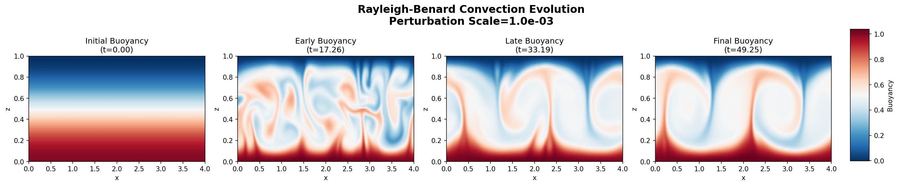
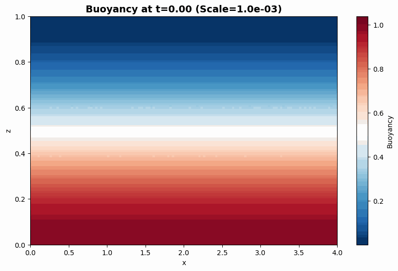

# Rayleigh-Benard Convection Dataset

Numerical solutions to the 2D Rayleigh-Benard convection equations using Dedalus.





## Variables

**Spatial Coordinates:**
- `spatial_coordinates`: (Nx*Nz, 2) - Spatial coordinates as (x, z) pairs

**Initial Conditions:**
- `buoyancy_initial`: (Nx*Nz,) - initial buoyancy field 
- `pressure_initial`: (Nx*Nz,) - initial pressure field (zero)
- `velocity_x_initial`: (Nx*Nz,) - initial x-velocity (zero)
- `velocity_z_initial`: (Nx*Nz,) - initial z-velocity (zero)
- `vorticity_initial`: (Nx*Nz,) - initial vorticity (zero)

**Temporal Evolution:**
- `buoyancy_trajectory`: (time_steps, Nx*Nz) - buoyancy evolution
- `pressure_trajectory`: (time_steps, Nx*Nz) - pressure evolution
- `velocity_x_trajectory`: (time_steps, Nx*Nz) - x-velocity evolution
- `velocity_z_trajectory`: (time_steps, Nx*Nz) - z-velocity evolution
- `vorticity_trajectory`: (time_steps, Nx*Nz) - vorticity evolution
- `time_coordinates`: (time_steps,) - time points

**Metadata:**
- `rayleigh_number`: Rayleigh number (default: 2e6)
- `prandtl_number`: Prandtl number (default: 1.0)
- `perturbation_scale`: Random perturbation amplitude
- `grid_shape_x`, `grid_shape_z`: Grid dimensions (default: 256×64)
- `domain_size_x`, `domain_size_z`: Domain size (default: 4×1)

## Physics

**Governing Equations:**
- **Continuity:** ∇·u = 0
- **Momentum:** ∂u/∂t - ν∇²u + ∇p - b*ẑ = -u·∇u  
- **Energy:** ∂b/∂t - κ∇²b = -u·∇b

**Parameters:**
- κ = (Ra×Pr)^(-1/2) - thermal diffusivity
- ν = (Ra/Pr)^(-1/2) - kinematic viscosity

**Boundary Conditions:**
- Bottom (z=0): Hot wall (b=Lz), no-slip (u=0)
- Top (z=Lz): Cold wall (b=0), no-slip (u=0)
- Sides: Periodic in x-direction

## Usage

**Generate Dataset:**
```bash
python generate_data.py
```

**Visualize Sample:**
```bash
python plot_sample.py        # 4-panel static plot
python plot_animation.py     # Animated GIF
```

**Load Data:**
```python
from rayleigh_benard_dataset import RayleighBenardDataset

dataset = RayleighBenardDataset()
sample = next(iter(dataset))

# Reshape flattened data back to 2D
Nx, Nz = sample["grid_shape_x"], sample["grid_shape_z"]
buoyancy = sample["buoyancy_initial"].reshape(Nx, Nz)
```